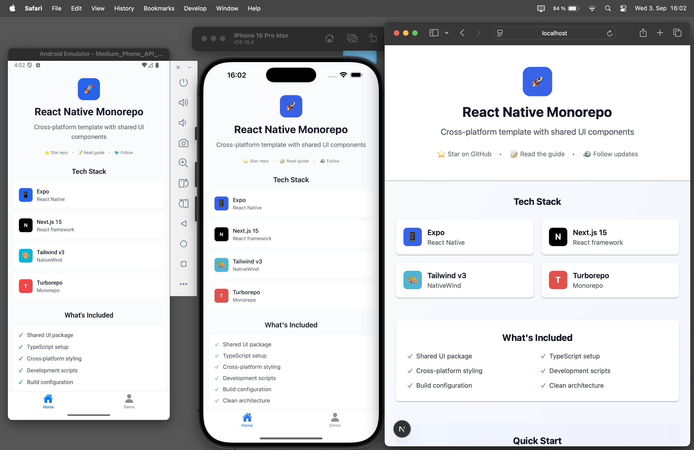

# React Native Monorepo Template

A clean, minimal template for building cross-platform applications with shared UI components.

## 📋 Current Versions & Updates

> **Note**: This template currently uses:
> - **Tailwind CSS v3** - Utility-first CSS framework
> - **NativeWind v4** - Tailwind CSS for React Native
> - **Expo SDK 53** - React Native development platform
>
> With the upcoming release of **Expo SDK 54**, **NativeWind v5**, and **Tailwind CSS v4**, this template will be updated to support the latest versions and features.

## 🚀 Features

- **🔄 Cross-Platform**: Share components between web and mobile
- **📦 Monorepo**: Turborepo with pnpm workspaces
- **🎨 Consistent Styling**: NativeWind (Tailwind for React Native)
- **⚡ Fast Development**: Hot reload on all platforms
- **📱 Modern Stack**: Next.js 15, Expo, React 19, TypeScript
- **🏗️ Clean Architecture**: Minimal, extensible, production-ready

## 📸 Demo

<p align="center">
  
</p>

*Cross-platform development: iOS Simulator, Android Emulator, and Web Browser running simultaneously with hot reload.*

## 🛠️ Tech Stack

| Technology | Purpose | Version |
|------------|---------|---------|
| **Turborepo** | Monorepo build system | Latest |
| **Next.js** | React framework for web | 15.x |
| **Expo** | React Native platform | 53.x |
| **React** | UI library | 19.0 |
| **NativeWind** | Cross-platform styling | 4.x |
| **TypeScript** | Type safety | 5.x |
| **pnpm** | Package manager | 10.x |

## 📁 Project Structure

```
universal-react-monorepo/
├── apps/
│   ├── mobile/          # Expo React Native app
│   └── web/             # Next.js web app
├── packages/
│   └── ui/              # Shared component library
├── CLAUDE.md            # AI assistant guidance
├── turbo.json           # Turborepo configuration
└── package.json         # Root dependencies & scripts
```

## 🚦 Quick Start

### Prerequisites

- Node.js 18+ 
- pnpm 10+
- iOS Simulator (for iOS development)
- Android Studio (for Android development)

### Installation

```bash
# Clone the repository
git clone https://github.com/gurselcakar/universal-react-monorepo.git
cd universal-react-monorepo

# Install dependencies
pnpm install
```

### Development

```bash
# Start all apps (web + mobile)
pnpm dev

# Start individual apps
pnpm --filter web dev      # Next.js web app
pnpm --filter mobile dev   # Expo mobile app
```

### Platform-Specific Commands

```bash
# Mobile development
cd apps/mobile
pnpm ios       # iOS simulator
pnpm android   # Android emulator
pnpm web       # Web browser

# Web development
cd apps/web
pnpm dev       # Development server
pnpm build     # Production build
pnpm start     # Production server
```

## 🏗️ Architecture

### Cross-Platform Components

Components in `packages/ui/` use React Native primitives with NativeWind styling:

```tsx
// Shared Button component with tailwind-variants
import { tv } from 'tailwind-variants';

const buttonVariants = tv({
  slots: {
    button: 'px-6 py-3 rounded-lg active:opacity-80',
    text: 'text-center font-semibold',
  },
  variants: {
    variant: {
      primary: { button: 'bg-blue-600', text: 'text-white' },
      secondary: { button: 'bg-gray-200', text: 'text-gray-900' },
    },
  },
});

export function Button({ title, onPress, variant = 'primary' }) {
  const { button, text } = buttonVariants({ variant });
  return (
    <Pressable onPress={onPress} className={button()}>
      <Text className={text()}>{title}</Text>
    </Pressable>
  );
}
```

### Web Integration

Next.js uses React Native Web to render components as HTML:

```tsx
// In web app - mixing React and React Native
export default function Page() {
  return (
    <div className="container">          {/* HTML element */}
      <Button title="Shared Component" /> {/* React Native component */}
    </div>
  );
}
```

### Mobile Native

Expo renders components natively on iOS/Android with identical styling and behavior.

## 🎨 Styling System

NativeWind enables Tailwind CSS classes on React Native components:

```tsx
<View className="flex-1 bg-gray-50 p-4">
  <Text className="text-2xl font-bold text-gray-900 mb-4">
    Styled with Tailwind
  </Text>
</View>
```

## 📋 Available Scripts

| Command | Description |
|---------|-------------|
| `pnpm dev` | Start all apps in development |
| `pnpm build` | Build all apps for production |
| `pnpm lint` | Lint all workspaces |
| `pnpm check-types` | TypeScript type checking |

## 🚀 Deployment

### Web App (Vercel)

```bash
cd apps/web
pnpm build
# Deploy to your preferred platform
```

### Mobile App

```bash
cd apps/mobile
# iOS
eas build --platform ios

# Android  
eas build --platform android
```

## 📚 Documentation

### Core Technologies
- **[Next.js](https://nextjs.org/docs)** - React framework with App Router
- **[Expo](https://docs.expo.dev/)** - React Native development platform
- **[Turborepo](https://turbo.build/repo/docs)** - High-performance build system
- **[React Native](https://reactnative.dev/docs/getting-started)** - Cross-platform mobile development
- **[TypeScript](https://www.typescriptlang.org/docs/)** - Type-safe JavaScript

### Styling & UI
- **[Tailwind CSS v3](https://tailwindcss.com/docs)** - Utility-first CSS framework
- **[NativeWind](https://www.nativewind.dev/)** - Tailwind CSS for React Native
- **[React Native Web](https://necolas.github.io/react-native-web/)** - RN components for web

### Development Tools
- **[pnpm](https://pnpm.io/motivation)** - Fast, disk space efficient package manager
- **[Expo Router](https://docs.expo.dev/router/introduction/)** - File-based routing for React Native
- **[EAS Build](https://docs.expo.dev/build/introduction/)** - Cloud build service for React Native

### Deployment
- **[Vercel](https://vercel.com/docs)** - Web app deployment platform
- **[EAS Submit](https://docs.expo.dev/submit/introduction/)** - App store submission service

## 🤝 Contributing

1. Fork the repository
2. Create a feature branch: `git checkout -b feature/amazing-feature`
3. Commit changes: `git commit -m 'Add amazing feature'`
4. Push to branch: `git push origin feature/amazing-feature`
5. Open a Pull Request

## 📄 License

This project is licensed under the MIT License.

## 🔗 Links

- [⭐ Star on GitHub](https://github.com/gurselcakar/universal-react-monorepo)
- [📝 Read the guide](https://gurselcakar.dev/writing/monorepo-guide)
- [🐦 Follow updates](https://twitter.com/gurselcakar)

---

**Built with Turborepo • Next.js • Expo • NativeWind**
